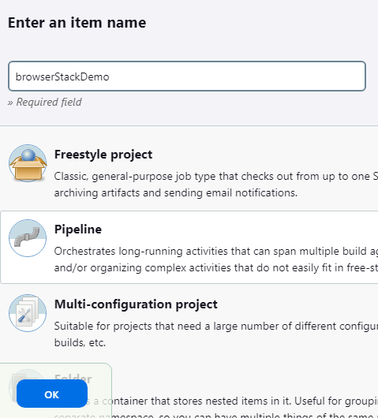

**Hello**🖐 **Automated Testing for Curahealthcare Demo Website with Selenium (Pytest, POM, HTML Reports, Jenkins Pipeline)**

This project tests various functionalities of the bstack(e-commerce) demo website, such as valid login, check favourites icon functionality, add to cart multiple products, removing products in add to cart, and deleting checking out products.
___________________________________________

🎯 **Pre-requisites:**
- Python 3
- Any browsers(Chrome, Firefox, Edge)
___________________________________________

▶ **Test Execution**

Run commands: 
1. Install Dependecies:

       pip install -r requirements.txt
2. Run the test with html report:

       pytest -v --html=report.html 
   or specifying browser

       pytest -v --browser=edge --html=report.html
    

**To run this on jenkins**
1. Add item name, click Pipeline and click OK
   
2. Locate pipeline header and select pipeline script from SCM
   
3. Choose GIT
   
4. Paste the repo url and click and save
   
5. Click build now
   

    
   
   
    
