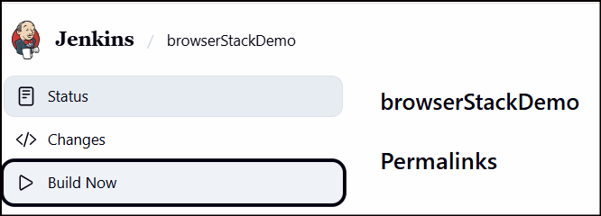

**Hello**🖐 **Automated Testing for browserStack (E-COMMERCE) Demo Website with (Selenium, Pytest, Page Object Model(POM), Allure Reports, Jenkins Pipeline)**

This project automates the testing of BStack E-commerce, focusing on essential user journeys such as login, adding items to cart, checkout, and order verification.

Aside from the main flow, I also tested several edge cases to make sure the system handles unusual user actions properly. 
These include:
   - Logging in with incorrect or missing credentials
   - Adding multiple quantities of a product to the cart 
   - Submitting order details with empty or invalid fields 
   - Removing items from the cart before checkout 
   - Adding and removing products from favourites
___________________________________________

🎯 **Pre-requisites:**
- Python 3.11.9
- Any browsers(Chrome, Firefox, Edge)
___________________________________________

▶ **Test Execution**

Run commands: 
1. Install Dependecies:

       pip install -r requirements.txt
2. Run the test with Allure report:

       pytest -v --alluredir=reports/TestCase1
   or specifying browser

       pytest -v --browser=edge --alluredir=reports/TestCase1
    

**To run this on jenkins**
1. Add item name, click Pipeline and click OK
    
    
2. Scroll down and navigate to Pipeline then select "pipeline script from SCM"
    
   
3. Select Git
    
   
4. Paste the Repo URL and click Apply and Save
    
   
5. Click build now
    
   
   

    
   
   
    
